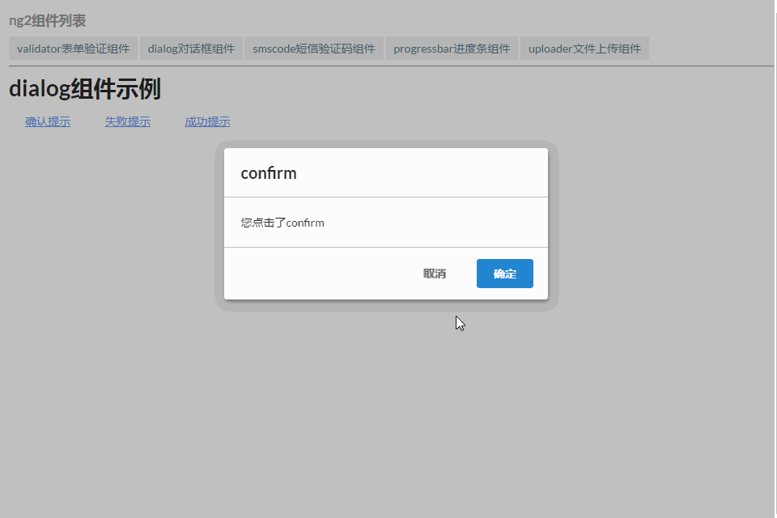
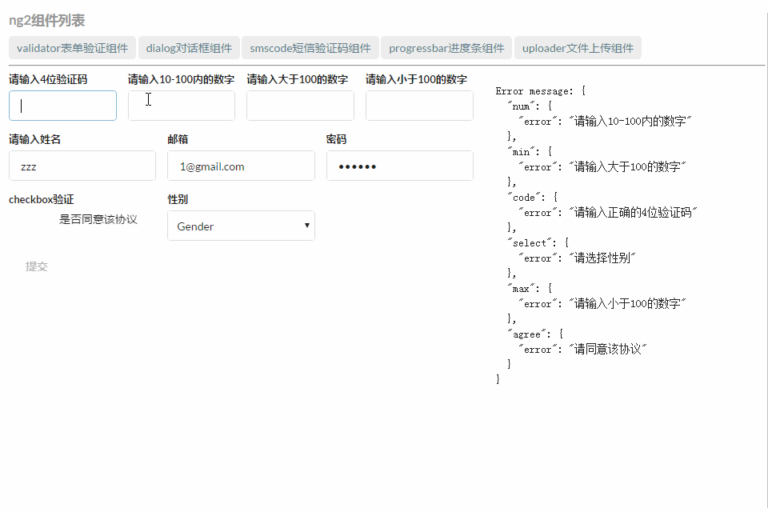
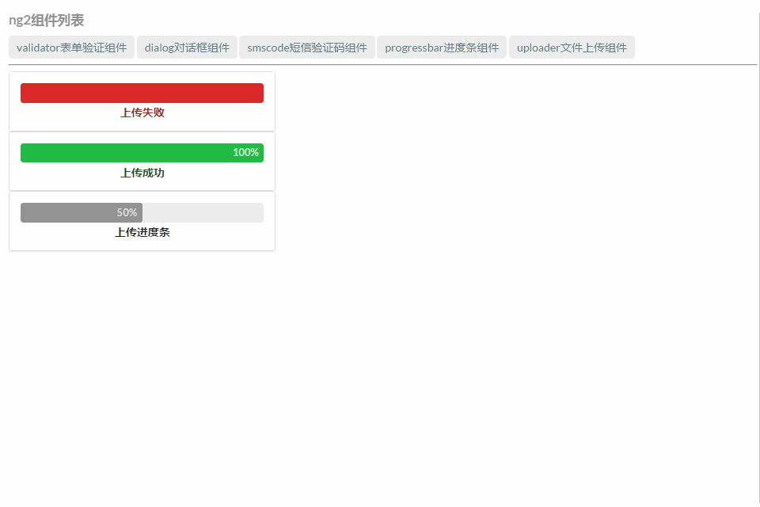
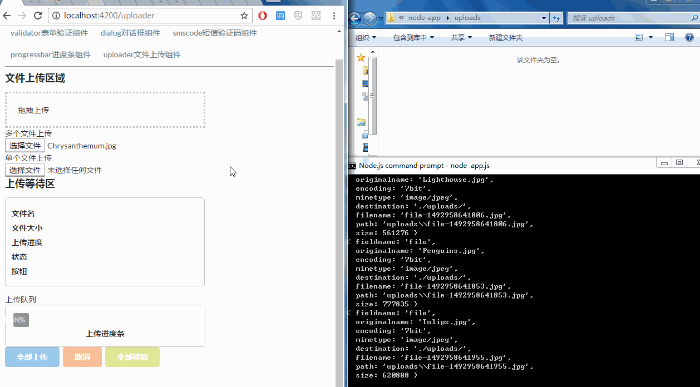
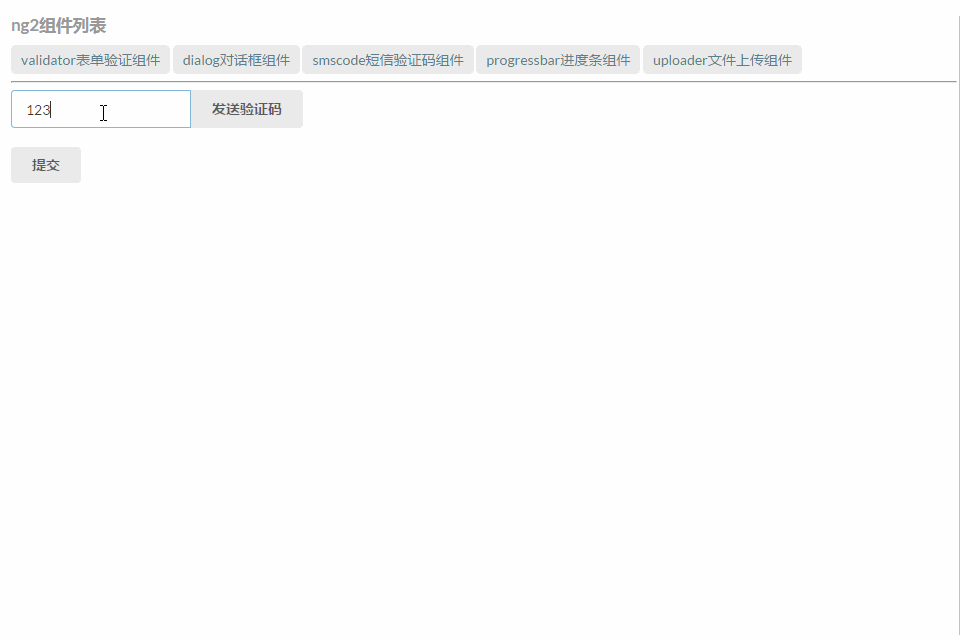

# ng2-components[ng2组件开发]
## 命令


```bash
    cd ng2-components
    npm install
    npm start
```

> 为了配合upload组件的文件post需求，需要用Node.js搭建一个mini上传服务。重开一个命令行窗口，然后


```bash
    cd node-app
    npm install
    node app.js
```


## 目录架构
|-node-app[mini文件上传服务]  


|-ng2-components/src/[angular2组件]

|-|-app[逻辑代码]  

|-|-assets[semantic-ui css库]


## 目前已经集成的组件
##### dialog  [弹出框组件 示例代码](./ng2-components/src/app/example/dialog/demo.ts)
##### validate [表单验证组件 示例代码](./ng2-components/src/app/example/validate/demo.ts)
##### progressBar [进度条组件 示例代码](./ng2-components/src/app/example/progressBar/demo.ts)
##### uploader [文件上传组件 示例代码](./ng2-components/src/app/example/uploader/demo.ts)
##### countdown [验证码倒计时 示例代码](./ng2-components/src/app/example/smscode/demo.ts)


## UI展示
> dialog 弹出框组件



> validate 表单验证组件



> progressBar 进度条组件



> uploader 文件上传组件



> countdown 倒计时




## [本项目原版为slashhuang用angular 2.X版本写的ng2-components,这里升级为了angular4.0，并增加了Node.js文件上传服务，感谢slashhuang](https://github.com/slashhuang/ng2-components)
